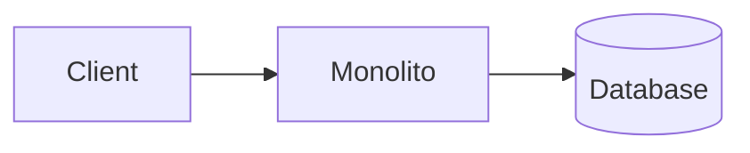
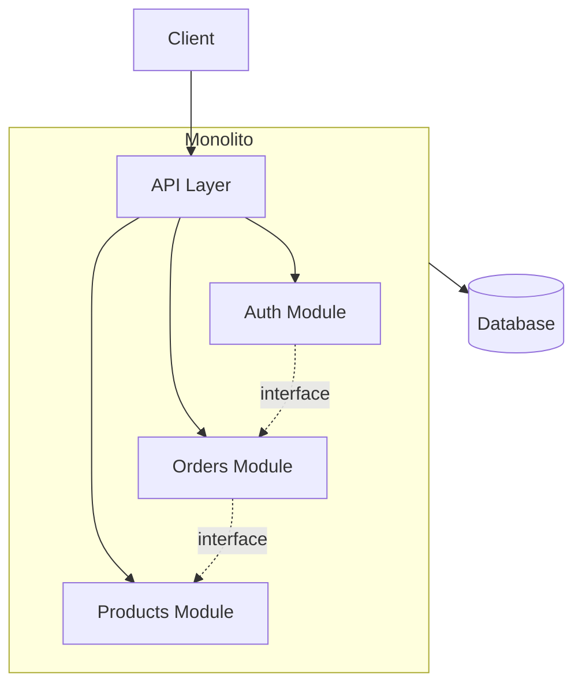
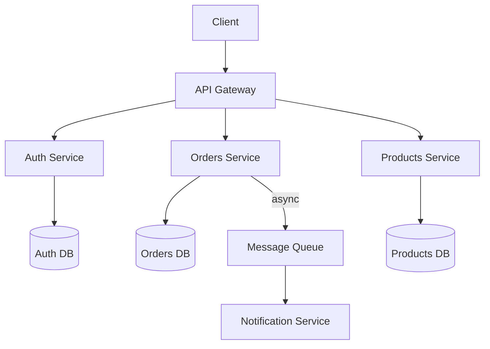
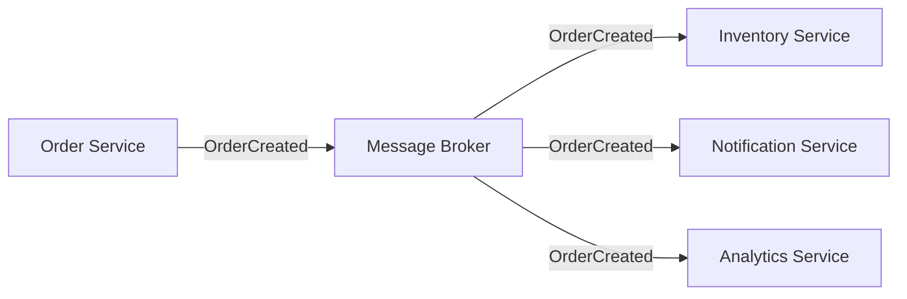
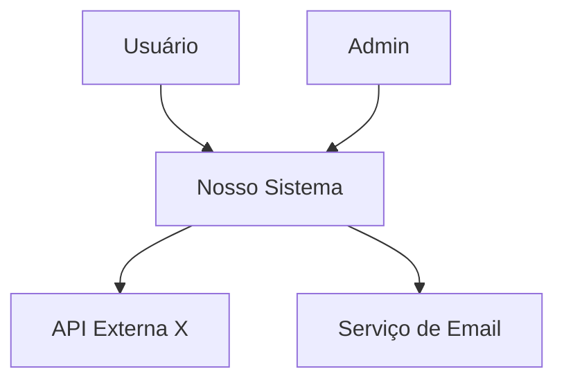
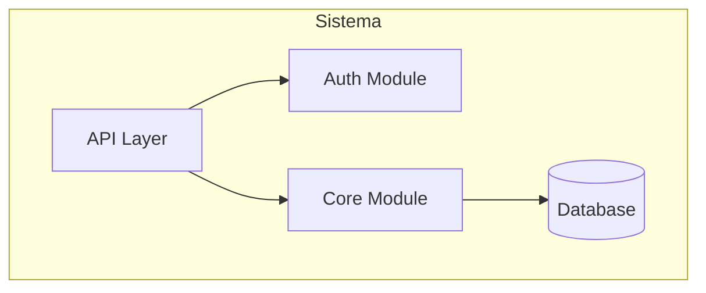
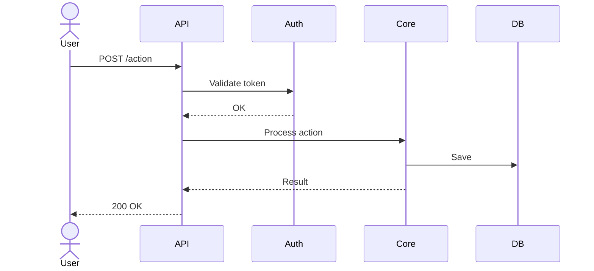

# Architecture Patterns — Catálogo com Trade-offs

## Índice
1. Como Escolher o Padrão
2. Monolito
3. Monolito Modular
4. Microserviços
5. Serverless
6. Event-Driven
7. CQRS + Event Sourcing
8. Padrões de Comunicação
9. Template do Documento de Arquitetura

---

## 1. Como Escolher o Padrão

Não existe padrão "melhor". A escolha depende do contexto:

```
É MVP / time pequeno (1-3 devs)?
├── SIM → Monolito ou Monolito Modular
└── NÃO → Continuar ↓

Time tem experiência com distribuídos?
├── NÃO → Monolito Modular (simular boundaries sem distribuir)
└── SIM → Continuar ↓

Domínios são independentes com escalas diferentes?
├── SIM → Microserviços
└── NÃO → Continuar ↓

Tem muita I/O assíncrona ou processamento em background?
├── SIM → Event-Driven ou Serverless
└── NÃO → Monolito Modular (provavelmente suficiente)
```

**Regra de ouro**: Comece com o padrão mais simples que resolve o problema.
Migrar de monolito para microserviços é possível; o inverso é doloroso.

---

## 2. Monolito

**O que é**: Uma aplicação única que contém todo o código, deploy como uma unidade.



| ✅ Ganha | ❌ Perde |
|----------|---------|
| Simplicidade de desenvolvimento | Escalabilidade granular |
| Deploy simples (1 artefato) | Time grande pisa nos pés |
| Debugging fácil (stack trace único) | Acoplamento cresce com o tempo |
| Latência baixa (chamadas in-process) | Deploy é tudo ou nada |
| Transações ACID triviais | Tecnologia única |

**Quando usar**: MVP, time ≤ 5 devs, domínio simples, deadline apertado.
**Quando evitar**: Múltiplos times, domínios muito distintos, escala assimétrica.

---

## 3. Monolito Modular

**O que é**: Monolito com boundaries claras entre módulos. O melhor dos dois mundos
para a maioria dos projetos.



| ✅ Ganha | ❌ Perde |
|----------|---------|
| Simplicidade de deploy | Requer disciplina de boundaries |
| Boundaries claras por módulo | Ainda é um deploy único |
| Fácil extrair para microserviço depois | Risco de "furar" boundaries |
| Performance de chamadas in-process | Single point of failure |
| Transações ACID entre módulos | |

**Regras para manter modular:**
- Módulos se comunicam APENAS via interfaces (nunca acesso direto ao DB do outro)
- Cada módulo pode ter seu schema/tabelas separadas no mesmo DB
- Dependências unidirecionais (sem ciclos)
- Testes de módulo são independentes

**Quando usar**: Maioria dos projetos. Sério. Mesmo os "grandes".
**Quando evitar**: Quando time já está distribuído E domínios precisam escalar independentemente.

---

## 4. Microserviços

**O que é**: Múltiplos serviços independentes, cada um com deploy, banco e ciclo de vida próprios.



| ✅ Ganha | ❌ Perde |
|----------|---------|
| Escalabilidade independente | Complexidade operacional massiva |
| Times autônomos | Debugging distribuído é difícil |
| Tecnologia por serviço | Latência de rede entre serviços |
| Deploy independente | Consistência eventual (sem ACID cross-service) |
| Fault isolation | Precisa de: service discovery, tracing, circuit breaker |

**Custo real que as pessoas esquecem:**
- Precisa de CI/CD por serviço
- Precisa de monitoramento distribuído (tracing, logs centralizados)
- Precisa de estratégia de comunicação (sync vs async)
- Precisa de contract testing entre serviços
- Precisa de orquestração de deploy (Kubernetes ou similar)

**Quando usar**: Times grandes (>10 devs), domínios com escala muito diferente,
necessidade de deploy independente real.
**Quando evitar**: MVP, time pequeno, se "microserviços" é só buzzword no currículo.

---

## 5. Serverless

**O que é**: Functions as a Service (FaaS). Código executa em resposta a eventos,
sem gerenciar servidores.

| ✅ Ganha | ❌ Perde |
|----------|---------|
| Zero gerenciamento de infra | Cold start latency |
| Pay-per-use (pode ser barato) | Vendor lock-in forte |
| Escala automática | Debugging local é ruim |
| Bom para eventos/webhooks | Limite de execução (15min Lambda) |

**Quando usar**: APIs com tráfego variável, processamento de eventos,
webhooks, cron jobs, MVP que precisa de infra zero.
**Quando evitar**: Aplicações stateful, latência crítica, processamento longo.

---

## 6. Event-Driven

**O que é**: Serviços se comunicam por eventos assíncronos via message broker.



| ✅ Ganha | ❌ Perde |
|----------|---------|
| Desacoplamento forte | Rastreabilidade é complexa |
| Resiliente (retry, dead letter) | Debugging de fluxo assíncrono |
| Processamento paralelo natural | Consistência eventual |
| Fácil adicionar consumers | Ordem de eventos pode importar |

**Quando usar**: Fluxos de notificação, processamento de pagamentos,
integração entre sistemas, analytics em real-time.

---

## 7. CQRS + Event Sourcing

**O que é**: Separar operações de leitura (Query) e escrita (Command),
com histórico completo de eventos como fonte de verdade.

| ✅ Ganha | ❌ Perde |
|----------|---------|
| Audit trail completo | Complexidade MUITO alta |
| Performance de leitura otimizada | Curva de aprendizado íngreme |
| Replay de eventos para debug | Eventual consistency obrigatória |
| Projeções diferentes para diferentes necessidades | Storage de eventos cresce |

**Quando usar**: Sistemas financeiros, compliance pesada, domínios onde
o histórico é mais importante que o estado atual.
**Quando evitar**: 95% dos projetos. Sério. Quase sempre é overkill.

---

## 8. Padrões de Comunicação

### Sync vs Async

| | Síncrono (HTTP/gRPC) | Assíncrono (Mensageria) |
|--|---------------------|------------------------|
| **Quando** | Precisa da resposta agora | Não precisa esperar |
| **Exemplo** | GET /users/123 | "Enviar email de boas-vindas" |
| **Falha** | Caller espera ou timeout | Mensagem fica na fila, retry automático |
| **Acoplamento** | Alto (caller conhece o callee) | Baixo (producer não sabe quem consume) |

### API Gateway Pattern

Quando usar: Múltiplos serviços precisam ser expostos como uma API unificada.

```
Cliente → API Gateway → {Auth, Rate Limit, Route} → Serviço correto
```

### BFF (Backend for Frontend)

Quando usar: Frontends diferentes (web, mobile, TV) precisam de dados formatados diferente.

```
Web App → BFF Web → Services
Mobile → BFF Mobile → Services
```

---

## 9. Template do Documento de Arquitetura

```markdown
# 03 — Arquitetura

## Padrão Escolhido
**[Monolito / Monolito Modular / Microserviços / Serverless / Event-Driven]**

### Justificativa
[Por que este padrão e não outro, dado o contexto do projeto]

### Trade-offs aceitos
| Ganhamos | Perdemos | Aceitável porque |
|----------|---------|------------------|
| | | |

---

## Diagrama de Contexto (C4 Level 1)
> O sistema e o que existe ao redor dele.



## Diagrama de Componentes (C4 Level 2)
> As grandes peças internas do sistema.



## Fluxos Principais

### Fluxo 1: [Nome do fluxo]


## Módulos / Serviços

| Módulo | Responsabilidade | Dependências |
|--------|-----------------|--------------|
| Auth | Autenticação e autorização | Database |
| Core | Lógica de negócio principal | Auth, Database |

## Decisões Arquiteturais (ADRs)

### ADR-001: [Título]
- **Status:** Aceita
- **Contexto:** [Situação]
- **Decisão:** [O que decidimos]
- **Consequências:** [O que ganhamos e perdemos]
```
