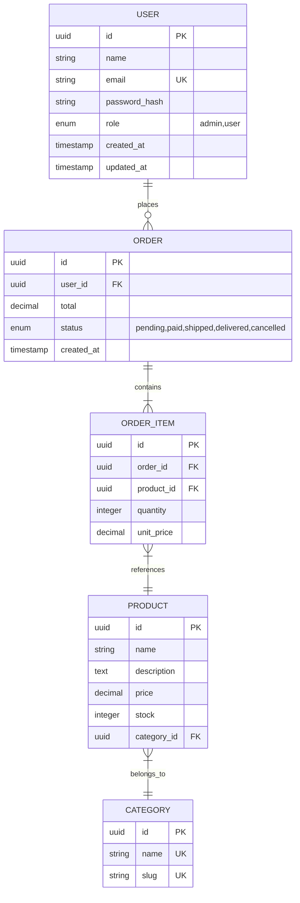

# Data Modeling Guide — Modelagem de Dados

## Índice
1. Processo de Modelagem
2. Identificação de Entidades
3. Relacionamentos
4. Normalização vs Desnormalização
5. Indexação
6. Template do Documento

---

## 1. Processo de Modelagem

```
Requisitos → Entidades → Atributos → Relacionamentos → Normalização → Índices → Validação
```

### Regras fundamentais

- Cada entidade representa um "substantivo" do domínio (User, Order, Product)
- Cada atributo é um fato sobre a entidade (name, price, created_at)
- Relacionamentos representam como entidades se conectam
- Modelar para as QUERIES que o sistema vai fazer, não só para os dados que armazena
- Timestamps (`created_at`, `updated_at`) em TODA tabela
- Soft delete (`deleted_at`) quando o domínio exigir auditoria
- UUIDs como PK pública; integers auto-increment como PK interna (quando performance importa)

---

## 2. Identificação de Entidades

### Técnica: Extrair dos Requisitos

Ler cada user story e sublinhar os substantivos:

```
"Como ADMIN, eu quero criar um PRODUTO com CATEGORIA, definir PREÇO
e associar IMAGENS para que CLIENTES possam ver no CATÁLOGO."

Entidades candidatas: Admin (→ User), Produto, Categoria, Preço (→ atributo),
Imagem, Cliente (→ User), Catálogo (→ view, não entidade)
```

### Checklist por entidade

```markdown
### [NomeEntidade]

**Descrição:** [O que representa no domínio]

**Atributos:**
| Campo | Tipo | Nullable | Default | Descrição |
|-------|------|----------|---------|-----------|
| id | UUID/BIGINT | NO | auto | Identificador único |
| ... | | | | |
| created_at | TIMESTAMP | NO | now() | Data de criação |
| updated_at | TIMESTAMP | NO | now() | Última atualização |

**Constraints:**
- UNIQUE: [campos]
- CHECK: [validações]

**Índices sugeridos:**
- [campo(s)] — para [query específica]
```

---

## 3. Relacionamentos

| Tipo | Mermaid | Implementação |
|------|---------|---------------|
| 1:1 | `A \|\|--\|\| B` | FK em qualquer lado (prefira no dependente) |
| 1:N | `A \|\|--o{ B` | FK no lado N (B tem `a_id`) |
| N:N | `A }o--o{ B` | Tabela associativa (`a_b` com `a_id` + `b_id`) |

### Mermaid ER Diagram Syntax



---

## 4. Normalização vs Desnormalização

### Quando normalizar (default)
- Dados que mudam com frequência
- Integridade referencial é importante
- Storage não é concern (< 1TB)
- Queries são previsíveis

### Quando desnormalizar
- Queries de leitura pesada que fazem muitos JOINs
- Dados calculados que seriam muito caros para computar on-the-fly
- Caches materializados (materialized views)
- Search indexes (Elasticsearch, etc.)

### Padrão: normalizar e criar views/caches para leitura

```sql
-- Tabelas normalizadas (source of truth)
CREATE TABLE orders (...);
CREATE TABLE order_items (...);

-- View materializada para dashboard (desnormalizada para leitura)
CREATE MATERIALIZED VIEW order_summary AS
SELECT o.id, o.status, o.created_at,
       COUNT(oi.id) as items_count,
       SUM(oi.quantity * oi.unit_price) as total
FROM orders o
JOIN order_items oi ON oi.order_id = o.id
GROUP BY o.id;
```

---

## 5. Indexação

### Regras de indexação

1. **PK e FK** — índice automático na maioria dos bancos
2. **Campos de busca** — WHERE frequente = índice
3. **Campos de ordenação** — ORDER BY frequente = índice
4. **Campos UNIQUE** — índice automático
5. **Índices compostos** — na ordem da query (leftmost prefix rule)
6. **Não indexar tudo** — cada índice custa em write performance

### Template de análise de índices

```markdown
### Queries frequentes e índices

| Query | Frequência | Campos WHERE/ORDER | Índice sugerido |
|-------|-----------|-------------------|-----------------|
| Listar pedidos do user | Alta | user_id, created_at DESC | (user_id, created_at DESC) |
| Buscar produto por nome | Alta | name (LIKE) | name (trigram/full-text) |
| Filtrar por status | Média | status | status (se cardinalidade razoável) |
```

---

## 6. Template do Documento

```markdown
# 04 — Modelo de Dados

## Resumo
- Entidades: [X]
- Relacionamentos: [Y]
- Database: [PostgreSQL / MySQL / MongoDB / ...]
- Estratégia de IDs: [UUID / auto-increment / ULID]

---

## Diagrama ER

```mermaid
erDiagram
    (... diagrama completo ...)
```

---

## Entidades

### [Entidade 1]
**Descrição:** [...]

| Campo | Tipo | Null | Default | Descrição |
|-------|------|------|---------|-----------|
| | | | | |

**Constraints:** [...]
**Índices:** [...]

(... repetir para cada entidade ...)

---

## Enums / Tipos

| Enum | Valores | Usado em |
|------|---------|----------|
| order_status | pending, paid, shipped, delivered, cancelled | orders.status |

---

## Índices Adicionais

| Tabela | Campos | Tipo | Justificativa |
|--------|--------|------|---------------|
| | | | |

---

## Migrations (ordem sugerida)

1. `001_create_users`
2. `002_create_categories`
3. `003_create_products`
4. `004_create_orders`
5. `005_create_order_items`

---

## Seed Data (dados iniciais)
- [Categorias padrão]
- [Usuário admin]
- [Configurações iniciais]
```
