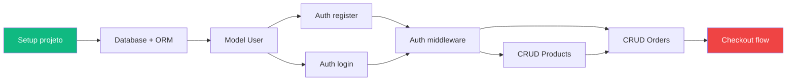

# Task Breakdown Guide — Decomposição e Priorização

## Índice
1. Princípios de Decomposição
2. Estrutura de Épicos e Tasks
3. Priorização
4. Estimativa
5. Ordem de Implementação (Critical Path)
6. Template do Documento

---

## 1. Princípios de Decomposição

### A regra das 4 horas

Toda task deve levar **no máximo 4 horas** de trabalho focado.
Se a estimativa passa de 4h, a task é grande demais — quebre-a.

Por quê:
- Tasks pequenas dão sensação de progresso (motivação)
- Fácil de revisar em code review (PRs menores)
- Fácil de estimar (menos incerteza)
- Fácil de paralisar e retomar
- Mostra progresso real no board

### Características de uma boa task

| ✅ Boa task | ❌ Task ruim |
|------------|-------------|
| "Criar endpoint POST /users com validação" | "Implementar o backend" |
| "Adicionar migration da tabela orders" | "Configurar o banco de dados" |
| "Implementar componente LoginForm" | "Fazer a tela de login" |
| Verbo + objeto + escopo claro | Vago, genérico, sem fim definido |
| Tem critérios de done verificáveis | "Funcionar" |
| Uma pessoa consegue fazer sozinha | Depende de 3 coisas não feitas |

### De requisitos para tasks

```
Requisito (RF-AUTH-001: Cadastro de usuário)
│
├── Épico: Autenticação
│   │
│   ├── Task: Criar model User + migration                    [2h]
│   ├── Task: Implementar endpoint POST /auth/register        [3h]
│   ├── Task: Implementar validação de email + senha           [1h]
│   ├── Task: Implementar envio de email de confirmação        [2h]
│   ├── Task: Criar tela de cadastro (frontend)                [3h]
│   ├── Task: Conectar form ao endpoint                        [1h]
│   ├── Task: Testes unitários do register                     [2h]
│   └── Task: Teste E2E do fluxo completo                      [1h]
│
└── Total estimado: ~15h
```

---

## 2. Estrutura de Épicos e Tasks

### Hierarquia

```
Projeto
├── Épico 1: [Módulo funcional]
│   ├── Task 1.1: [Ação específica]
│   ├── Task 1.2: [Ação específica]
│   └── Task 1.3: [Ação específica]
├── Épico 2: [Módulo funcional]
│   ├── Task 2.1
│   └── Task 2.2
└── Épico 0: Setup & Infra (sempre existe)
    ├── Task 0.1: Inicializar projeto (boilerplate)
    ├── Task 0.2: Configurar CI/CD
    ├── Task 0.3: Configurar database + ORM
    ├── Task 0.4: Setup de auth (middleware)
    └── Task 0.5: Setup de linting, formatting, pre-commit
```

### Formato de task

```markdown
### TASK-[épico]-[número]: [Título descritivo]

**Épico:** [Nome do épico]
**Prioridade:** P0 | P1 | P2
**Estimativa:** [Xh]
**Depende de:** [TASK-X-Y] ou "Nenhuma"
**Requisito(s):** [RF-XXX-NNN]

**Descrição:**
[O que fazer, em 2-3 frases]

**Critérios de Done:**
- [ ] [Condição verificável 1]
- [ ] [Condição verificável 2]
- [ ] [Testes escritos e passando]

**Notas técnicas:**
- [Detalhes de implementação relevantes]
```

---

## 3. Priorização

### Níveis de prioridade

| Prioridade | Significado | Regra |
|-----------|-------------|-------|
| **P0** | MVP — sem isso não lança | Mínimo viável que entrega valor |
| **P1** | Importante — entra logo após MVP | Melhora significativa de UX ou completude |
| **P2** | Nice-to-have — se der tempo | Melhorias, otimizações, polish |
| **P3** | Futuro — registrar e esquecer por agora | Backlog para próximas versões |

### Técnica MoSCoW

| Categoria | Descrição | % do escopo |
|-----------|-----------|-------------|
| **Must** | Sem isso o sistema não funciona | ~60% |
| **Should** | Importante mas tem workaround | ~20% |
| **Could** | Seria bom ter | ~15% |
| **Won't** | Não nessa versão (escopo negativo) | ~5% (documentado) |

### Como priorizar na prática

```
Para cada feature/task, perguntar:

1. "Se não tiver isso, o sistema serve pra alguma coisa?"
   NÃO → P0
   SIM → próxima pergunta

2. "O usuário vai reclamar na primeira semana sem isso?"
   SIM → P1
   NÃO → próxima pergunta

3. "Isso diferencia o produto ou é 'apenas' qualidade?"
   DIFERENCIA → P2
   QUALIDADE → P2-P3

4. "Alguém pediu ou estamos inventando?"
   NINGUÉM PEDIU → P3
```

---

## 4. Estimativa

### Técnica: Estimate by Analogy

Comparar com tasks similares já feitas:
- "Esse endpoint é similar ao de users, que levou 2h → estimo 2-3h"
- Adicionar buffer de 20-50% para incerteza

### Ranges de estimativa comum

| Tipo de task | Range típico |
|-------------|-------------|
| CRUD endpoint simples | 1-2h |
| CRUD com validação complexa | 2-4h |
| Integração com API externa | 3-4h |
| Migration + model | 0.5-1h |
| Componente UI simples (form, card) | 1-2h |
| Componente UI complexo (table, drag-drop) | 3-4h |
| Página completa (frontend) | 3-4h |
| Setup de projeto (boilerplate) | 2-3h |
| Configurar CI/CD básico | 2-3h |
| Testes unitários de um módulo | 1-2h |
| Teste E2E de um fluxo | 1-2h |

### Regra da incerteza

| Confiança | Multiplicador | Quando |
|-----------|--------------|--------|
| Alta | 1x | Já fez algo idêntico |
| Média | 1.5x | Similar mas com diferenças |
| Baixa | 2x | Primeira vez, tech desconhecida |
| Desconhecida | Spike primeiro | Não dá pra estimar sem investigar |

**Spike**: Task exploratória de 2-4h para investigar viabilidade antes de estimar.

---

## 5. Ordem de Implementação (Critical Path)

### Fases de implementação

```
Fase 0: Fundação (1-2 dias)
├── Setup do projeto (boilerplate, deps, config)
├── Database setup + ORM
├── Auth básica (register, login, middleware)
├── CI/CD pipeline básico
└── Deploy pipeline (staging)

Fase 1: Core MVP (X dias)
├── Models + migrations das entidades principais
├── CRUD dos recursos core
├── Fluxo principal (happy path) end-to-end
└── Testes do fluxo principal

Fase 2: Completude (X dias)
├── Fluxos secundários
├── Validações e error handling
├── Permissões / RBAC
└── Edge cases

Fase 3: Polish (X dias)
├── UI/UX refinements
├── Performance optimization
├── Testes E2E completos
├── Monitoring / logging
└── Documentação de API
```

### Diagrama de dependências

Representar com Mermaid quais tasks bloqueiam outras:



Verde = início. Vermelho = entrega final do MVP.
O caminho mais longo (critical path) determina o prazo mínimo.

---

## 6. Template do Documento

```markdown
# 08 — Mapa de Tarefas

## Resumo

| Métrica | Valor |
|---------|-------|
| Total de épicos | [X] |
| Total de tasks | [X] |
| Tasks P0 (MVP) | [X] |
| Tasks P1 | [X] |
| Tasks P2+ | [X] |
| Estimativa total MVP | [Xh] (~[Y] dias de 1 dev) |
| Estimativa total completa | [Xh] |

---

## Fases de Implementação

### Fase 0: Fundação
**Estimativa:** [Xh] | **Prioridade:** P0

| ID | Task | Est. | Depende de | Status |
|----|------|------|-----------|--------|
| T-0-01 | Setup do projeto | 2h | — | ⬜ |
| T-0-02 | Database + ORM config | 1h | T-0-01 | ⬜ |
| T-0-03 | Auth middleware | 3h | T-0-02 | ⬜ |

### Fase 1: Core MVP
(... mesmo formato ...)

### Fase 2: Completude
(... ...)

### Fase 3: Polish
(... ...)

---

## Épicos Detalhados

### Épico: [Nome]
**Requisitos:** [RF-XXX-001, RF-XXX-002]
**Tasks:** [X] | **Estimativa:** [Xh]

#### TASK-[E]-[N]: [Título]
(... seguir formato da seção 2 ...)

---

## Diagrama de Dependências

```mermaid
graph LR
  (... critical path ...)
```

---

## Critical Path
O caminho mais longo é: T-0-01 → T-0-02 → T-0-03 → ... → T-X-Y
**Prazo mínimo estimado:** [X dias com 1 dev] | [Y dias com Z devs]

---

## Spikes Necessários (investigação antes de estimar)

| Spike | Objetivo | Estimativa do spike |
|-------|----------|-------------------|
| [Tema] | [O que investigar] | [2-4h] |

---

## Legenda de Status
- ⬜ Não iniciada
- 🔵 Em andamento
- ✅ Concluída
- 🔴 Bloqueada
- ⏸️ Pausada
```
