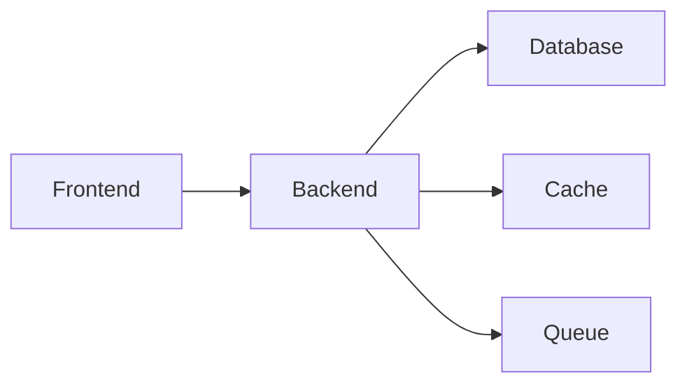

# Tech Decision Matrix — Framework de Avaliação

## Índice
1. Framework de Avaliação
2. Catálogo por Camada
3. Decisões Comuns com Trade-offs
4. Template do Documento

---

## 1. Framework de Avaliação

Para cada tecnologia, avaliar nestas dimensões (escala 1-5):

| Dimensão | Pergunta-chave |
|----------|---------------|
| **Adequação** | Resolve o problema específico que temos? |
| **Maturidade** | É estável? Tem histórico em produção? |
| **Ecossistema** | Tem libs, ferramentas, integrações? |
| **Comunidade** | Fácil achar ajuda? Stack Overflow, docs? |
| **Experiência do time** | O time já sabe usar? Curva de aprendizado? |
| **Custo** | Free tier? Pricing previsível? Vendor lock-in? |
| **Performance** | Atende os requisitos não-funcionais? |
| **Operação** | Fácil de deployar, monitorar, escalar? |

### Exemplo de avaliação

```markdown
| Dimensão | PostgreSQL | MongoDB | DynamoDB |
|----------|-----------|---------|----------|
| Adequação | 5 (relacional) | 3 (flexível mas perde joins) | 4 (key-value fits) |
| Maturidade | 5 | 4 | 5 |
| Ecossistema | 5 | 4 | 3 (AWS-only) |
| Comunidade | 5 | 4 | 3 |
| Experiência | 4 | 2 | 1 |
| Custo | 5 (open source) | 4 (Atlas free tier) | 3 (pay per request) |
| Performance | 4 | 4 | 5 (at scale) |
| Operação | 4 | 3 | 5 (managed) |
| **TOTAL** | **37** | **28** | **29** |
| **Escolha** | ✅ | | |
```

---

## 2. Catálogo por Camada

### Frontend

| Tecnologia | Melhor para | Trade-off principal |
|------------|-------------|-------------------|
| **React** | SPAs complexas, ecossistema | Bundle size, precisa de muitas libs |
| **Next.js** | SSR, SEO, full-stack React | Complexidade de deploy, vendor coupling |
| **Vue.js** | Curva suave, times menores | Ecossistema menor que React |
| **Svelte/SvelteKit** | Performance, simplicidade | Comunidade menor, menos libs |
| **Astro** | Sites estáticos com ilhas interativas | Não é pra SPAs |
| **HTMX** | Server-rendered com interatividade | Sem SPA capabilities |

### Backend

| Tecnologia | Melhor para | Trade-off principal |
|------------|-------------|-------------------|
| **Node.js (Express/Fastify)** | APIs rápidas, JS full-stack | Single-threaded, callback hell possível |
| **Node.js (NestJS)** | APIs estruturadas, enterprise | Overengineering para projetos simples |
| **Python (FastAPI)** | APIs com ML/data, tipagem | Performance inferior a Go/Rust |
| **Python (Django)** | CRUD admin-heavy, baterias inclusas | Monolítico, menos flexível |
| **Go** | Alta performance, microserviços | Verboso, ecossistema web menor |
| **Rust (Actix/Axum)** | Performance extrema, segurança | Curva de aprendizado altíssima |
| **Java (Spring Boot)** | Enterprise, ecossistema maduro | Verbose, startup lento |
| **C# (.NET)** | Enterprise Windows, Azure | Vendor coupling, menos popular fora de enterprise |
| **Elixir (Phoenix)** | Real-time, alta concorrência | Comunidade menor, curva BEAM |

### Database

| Tecnologia | Melhor para | Evitar quando |
|------------|-------------|---------------|
| **PostgreSQL** | Maioria dos casos, relacional, JSONB | Escala horizontal massiva |
| **MySQL** | Web apps tradicionais, WordPress | Precisa de features avançadas (JSONB, CTE) |
| **MongoDB** | Schema flexível, protótipos rápidos | Dados altamente relacionais |
| **Redis** | Cache, sessões, filas simples, pub/sub | Persistência como source of truth |
| **SQLite** | Embedded, dev local, apps single-user | Multi-user concurrent writes |
| **DynamoDB** | Key-value at scale, serverless AWS | Queries complexas, fora da AWS |
| **Elasticsearch** | Full-text search, logs, analytics | Source of truth (use como index) |
| **Supabase** | PostgreSQL managed + auth + realtime | Controle total de infra |

### Deploy / Infra

| Tecnologia | Melhor para | Trade-off |
|------------|-------------|-----------|
| **Vercel** | Frontend, Next.js | Vendor lock-in, pricing em escala |
| **Railway** | Backend rápido, containers | Pricing pode escalar |
| **Fly.io** | Containers globais, edge | Complexidade de networking |
| **AWS (ECS/Lambda)** | Escala enterprise, flexibilidade total | Complexidade operacional alta |
| **GCP (Cloud Run)** | Containers serverless | Menos popular que AWS |
| **DigitalOcean** | Simplicidade, VPS | Menos serviços managed |
| **Docker + VPS** | Controle total, custo previsível | Operação manual |

### Auth

| Tecnologia | Melhor para | Trade-off |
|------------|-------------|-----------|
| **Auth próprio (JWT)** | Controle total, sem dependência | Precisa implementar tudo (reset pw, OAuth...) |
| **Clerk** | DX excelente, React-friendly | Vendor lock-in, pricing |
| **Auth0** | Enterprise, flexível | Complexo, pricing em escala |
| **Supabase Auth** | Se já usa Supabase | Coupling com Supabase |
| **Firebase Auth** | Mobile, Google ecosystem | Google lock-in |
| **Keycloak** | Enterprise self-hosted | Complexo de operar |

---

## 3. Decisões Comuns com Trade-offs

### SQL vs NoSQL

```
Dados relacionais (users, orders, products)? → SQL (PostgreSQL)
Dados sem schema fixo (logs, events, configs)? → NoSQL ou SQL com JSONB
Precisa de full-text search? → Elasticsearch como index, SQL como source
Precisa de cache rápido? → Redis na frente de SQL
Não sabe? → PostgreSQL (faz quase tudo)
```

### REST vs GraphQL

```
API pública com clientes variados? → REST (mais universal)
Frontend único que controla as queries? → GraphQL (menos over/underfetch)
Time pequeno, API simples? → REST (menos overhead)
Muitos relacionamentos, queries complexas? → GraphQL
Não sabe? → REST (mais simples, mais documentação, mais tooling)
```

### Monorepo vs Multirepo

```
Time pequeno (1-5 devs), projeto coeso? → Monorepo
Múltiplos times, deploy independente? → Multirepo
Libs compartilhadas entre projetos? → Monorepo com workspaces
Não sabe? → Monorepo (mais simples de começar)
```

---

## 4. Template do Documento

```markdown
# 06 — Tech Stack

## Resumo

| Camada | Tecnologia | Versão |
|--------|-----------|--------|
| Frontend | | |
| Backend | | |
| Database | | |
| Cache | | |
| Auth | | |
| Deploy | | |
| CI/CD | | |
| Monitoramento | | |

---

## Decisões Detalhadas

### [Camada]: [Tecnologia Escolhida]

**Por que essa:**
[Justificativa baseada no contexto do projeto]

**Alternativas consideradas:**
| Alternativa | Por que não |
|-------------|------------|
| [Tech B] | [Motivo] |
| [Tech C] | [Motivo] |

**Trade-offs aceitos:**
| Ganhamos | Perdemos |
|----------|---------|
| | |

**Custo estimado:**
- Dev: [free / $X/mês]
- Produção: [estimativa]

(... repetir para cada camada ...)

---

## Matriz de Avaliação Completa

| Dimensão | [Tech A] | [Tech B] | [Tech C] |
|----------|----------|----------|----------|
| Adequação | | | |
| Maturidade | | | |
| (... todas dimensões ...) | | | |
| **TOTAL** | | | |

---

## Dependências e Compatibilidade



## Riscos de Stack
| Risco | Mitigação |
|-------|-----------|
| [Lock-in em X] | [Abstrair com interface] |
```
