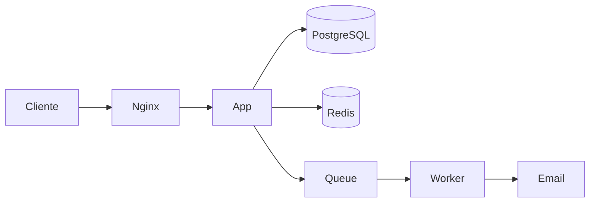
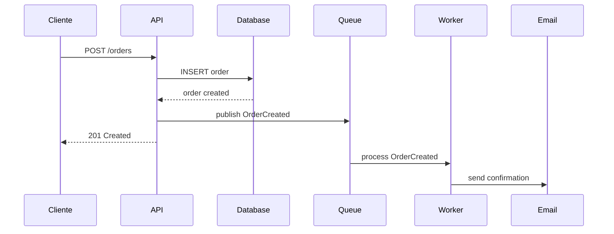

# Writing Principles — Escrita Técnica Eficaz

## Índice
1. Princípios Fundamentais
2. Tom por Tipo de Documento
3. Formatação e Estrutura
4. Exemplos: Antes e Depois
5. Diagramas e Visualizações
6. Internacionalização (pt-BR vs en)
7. Checklist de Qualidade

---

## 1. Princípios Fundamentais

### As 7 Regras da Escrita Técnica

```
1. CLAREZA    → Frase curta, voz ativa, sem ambiguidade
2. PRECISÃO   → Termos exatos, dados verificáveis, sem "aproximadamente"
3. CONCISÃO   → Dizer em 10 palavras o que poderia dizer em 30
4. EXEMPLO    → Código funcional, não descrição abstrata
5. ESTRUTURA  → Headers para scan rápido, hierarquia visual clara
6. AUDIÊNCIA  → Saber para quem está escrevendo e adaptar
7. TESTÁVEL   → Todo passo-a-passo pode ser seguido literalmente
```

### Voz ativa vs passiva

```
❌ Passiva: "O comando deve ser executado pelo desenvolvedor"
✅ Ativa:   "Execute o comando"

❌ Passiva: "O arquivo de configuração é lido pela aplicação na inicialização"
✅ Ativa:   "A aplicação lê o arquivo de configuração ao iniciar"

❌ Passiva: "Os testes devem ser escritos antes do merge"
✅ Ativa:   "Escreva os testes antes de fazer merge"
```

### Frases curtas

```
❌ "O sistema utiliza uma abordagem baseada em eventos para a
    orquestração dos microserviços através de um message broker
    que implementa o padrão publish-subscribe, permitindo assim
    o desacoplamento entre os serviços produtores e consumidores."

✅ "O sistema usa eventos para comunicar entre serviços. Quando
    um pedido é criado, o serviço de Orders publica um evento no
    RabbitMQ. O serviço de Inventory escuta esse evento e atualiza
    o estoque."
```

Regra: máximo 25 palavras por frase. Se passar, quebrar em duas.

### Concreto vs abstrato

```
❌ "Configure as variáveis de ambiente necessárias"
✅ "Copie .env.example para .env e preencha DATABASE_URL e JWT_SECRET"

❌ "Instale as dependências do projeto"
✅ "npm install"

❌ "Faça o deploy usando o método apropriado"
✅ "ssh deploy@prod 'cd /opt/app && git pull && docker compose up -d'"
```

---

## 2. Tom por Tipo de Documento

| Documento | Tom | Exemplo |
|----------|-----|---------|
| README | Acolhedor, claro | "Este projeto facilita X. Para começar, siga os passos abaixo." |
| API docs | Preciso, formal | "Retorna uma lista paginada de pedidos do usuário autenticado." |
| Onboarding | Didático, encorajador | "Não se preocupe se parecer muito no primeiro dia. Em uma semana você vai estar contribuindo." |
| Runbook | Direto, urgente | "1. SSH no servidor. 2. Rodar script X. 3. Verificar health." |
| ADR | Analítico, neutro | "Consideramos três opções. A Opção A foi escolhida porque..." |
| Changelog | Factual, conciso | "Adicionado sistema de cupons de desconto (#110)" |
| Troubleshooting | Empático, prático | "Se está vendo erro X, provavelmente é porque Y. Tente Z." |
| Post-mortem | Factual, sem culpa | "Às 14:32 o serviço ficou indisponível. A causa raiz foi..." |

---

## 3. Formatação e Estrutura

### Hierarquia visual

```markdown
# Título do Documento        ← 1 por doc
## Seção Principal            ← Navegação principal
### Sub-seção                 ← Detalhamento
#### Sub-sub (evitar)         ← Usar com moderação

Parágrafo curto (2-3 frases máximo antes de quebrar).

- Bullet para listas sem ordem
- Cada item com 1-2 frases

1. Numerado para sequências/passos
2. Cada passo é uma ação

| Tabela | Para | Comparações |
|--------|------|-------------|
| Dados  | Lado | A lado      |

> Callout para avisos, dicas ou informações importantes

`inline code` para nomes de arquivo, variáveis, comandos curtos

```bash
# Blocos de código para comandos e exemplos
npm install
```
```

### Quando usar cada formato

| Conteúdo | Formato |
|---------|---------|
| Sequência de passos | Lista numerada |
| Itens sem ordem | Bullet points |
| Comparação lado a lado | Tabela |
| Comando para copiar | Bloco de código |
| Aviso importante | Callout (>) |
| Definição de termo | Negrito + descrição inline |
| Referência a arquivo/variável | `monospace` |
| Diagrama de fluxo | ASCII art ou Mermaid |

### O que NÃO fazer

```
❌ Parágrafos com 10+ linhas sem quebra
❌ Headers sem conteúdo entre eles
❌ Listas com 1 item (não é lista)
❌ Mais de 3 níveis de heading (##, ###, ####)
❌ Screenshots de código (usar blocos de texto)
❌ Links sem contexto: "clique aqui"
✅ Links com contexto: "veja o guia de deploy"
```

---

## 4. Exemplos: Antes e Depois

### Setup Guide

```
ANTES (ruim):
"Para configurar o projeto, é necessário que o desenvolvedor
possua as ferramentas adequadas instaladas em seu ambiente de
desenvolvimento. Após a verificação das pré-condições, proceder
com a clonagem do repositório e subsequente instalação das
dependências do projeto utilizando o gerenciador de pacotes
apropriado à tecnologia empregada."

DEPOIS (bom):
## Setup

Pré-requisitos: Node.js 22+, PostgreSQL 16+, Docker.

```bash
git clone https://github.com/org/repo.git
cd repo
cp .env.example .env    # Editar com suas credenciais
npm install
npm run db:setup
npm run dev             # http://localhost:3000
```
```

### Descrição de endpoint

```
ANTES (ruim):
"Este endpoint é responsável por realizar a busca e retorno
dos pedidos pertencentes ao usuário que está atualmente autenticado
no sistema, podendo ser filtrados por diversos critérios conforme
necessidade."

DEPOIS (bom):
### GET /api/orders

Retorna os pedidos do usuário autenticado.

**Filtros opcionais:**
| Param | Tipo | Exemplo |
|-------|------|---------|
| `status` | string | `pending`, `shipped` |
| `from` | date | `2025-01-01` |
| `limit` | int | `20` (default) |
```

### Error handling

```
ANTES (ruim):
"Caso ocorra um erro durante o processamento da requisição,
o sistema retornará uma resposta com o código de status HTTP
apropriado e um corpo contendo informações sobre o erro ocorrido."

DEPOIS (bom):
Erros retornam JSON com `code` e `message`:

```json
{
  "error": {
    "code": "NOT_FOUND",
    "message": "Pedido não encontrado"
  }
}
```
```

---

## 5. Diagramas e Visualizações

### ASCII art (funciona em qualquer lugar)

```
Request → [Nginx] → [App] → [PostgreSQL]
                       ↓
                    [Redis]
                       ↓
                    [Queue] → [Worker] → [Email Service]
```

### Mermaid (renderiza no GitHub, GitLab, Notion)

````markdown

````



### Quando usar diagramas

```
USAR diagrama quando:
├── Fluxo entre componentes/serviços
├── Sequência de passos com branching
├── Relação entre entidades (ER diagram)
├── Fluxo de dados (input → processamento → output)
└── Qualquer coisa que texto puro não comunica bem

NÃO USAR quando:
├── Lista simples de itens
├── Passos sequenciais sem branching (usar lista numerada)
└── Quando o diagrama seria mais confuso que texto
```

---

## 6. Internacionalização (pt-BR vs en)

### Quando usar cada idioma

| Contexto | Idioma | Por quê |
|---------|--------|---------|
| README de projeto open-source | Inglês | Audiência global |
| README de projeto interno | Idioma do time | Acessibilidade |
| API docs | Inglês | Padrão da indústria |
| Código (variáveis, funções) | Inglês | Padrão universal |
| Commit messages | Definir no CONTRIBUTING e seguir | Consistência |
| Runbooks internos | Idioma do time | Clareza em emergência |
| ADRs | Definir no CONTRIBUTING e seguir | Consistência |
| Comentários no código | Inglês | Padrão da indústria |

### Regra geral

Se o time é brasileiro e o projeto é interno: docs em pt-BR, código em en.
Se o projeto é open-source ou multi-nacional: tudo em inglês.
O importante é ser **consistente** — não misturar idiomas no mesmo doc.

---

## 7. Checklist de Qualidade

### Antes de publicar qualquer doc

```
Conteúdo:
├── □ Informação está correta e atualizada?
├── □ Responde as perguntas da audiência?
├── □ Exemplos funcionam se copiados e colados?
├── □ Todos os comandos foram testados?
├── □ Links funcionam (não estão quebrados)?
└── □ Não tem informação sensível (secrets, IPs internos)?

Escrita:
├── □ Frases curtas (< 25 palavras)?
├── □ Voz ativa?
├── □ Sem jargão desnecessário?
├── □ Termos consistentes (não alternar sinônimos)?
├── □ Sem erros de ortografia/gramática?
└── □ Tom adequado para a audiência?

Estrutura:
├── □ Escaneável em 30 segundos?
├── □ Headers descrevem o conteúdo?
├── □ Blocos de código com linguagem especificada?
├── □ Tabelas alinhadas?
├── □ Não tem "wall of text" (parágrafos > 5 linhas)?
└── □ Data de última revisão (para docs importantes)?

Meta:
├── □ Owner definido (quem mantém este doc)?
├── □ Localização correta no repo (README na raiz, rest em docs/)?
├── □ Referenciado/linkado de outros docs relevantes?
└── □ Versionado junto com o código (não em wiki separada)?
```
